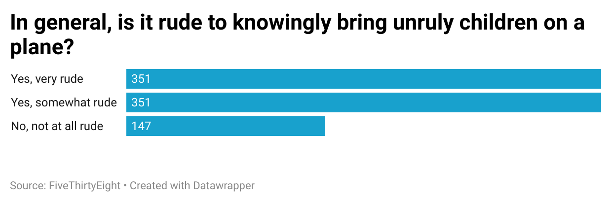

I picked the question "In general, is it rude to knowingly bring unruly children on a plane?" because I often wonder that myself. The data indicates that 83% of respondents think it is rude to bring unruly children on a plane. Only 17% thought knowingly bringing unruly children was not rude. It reveals that the majority of people find people who knowingly bring their poorly behaved kids on the plane to be rude. Interestingly, those who find this act rude were split 351 to 351 on wether it was very rude or somewhat rude. This reveals that it may bother some people more than others, but regardless unruly children makes people regard the parents negatively. 

